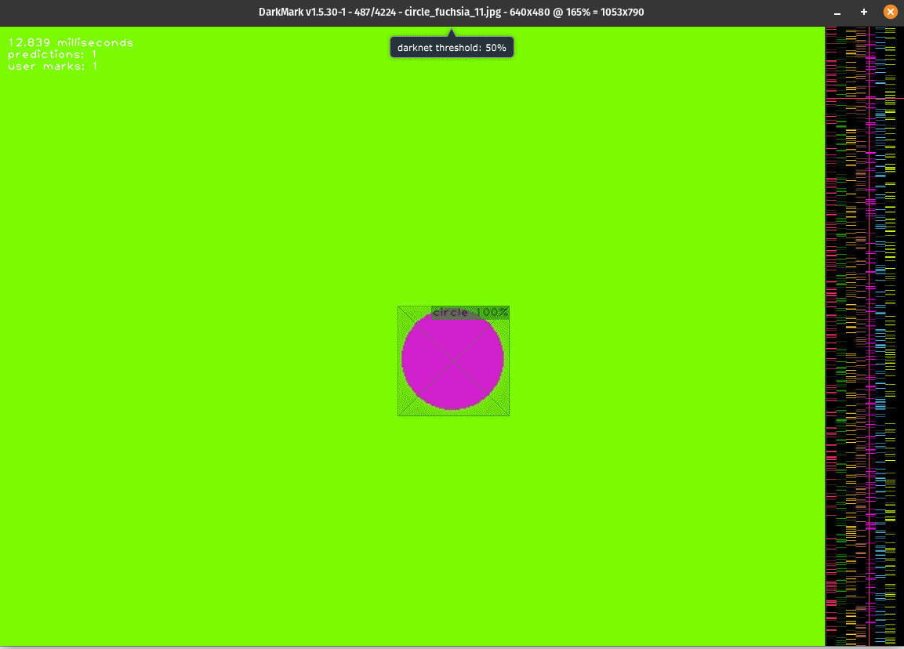

# darknet-resources
This repository is a collection of resources and tools and scripts that I found useful when working with the darknet framework. 

### ⚠️ This repo is still under development ⚠️

This is my first contribution to open source so this is very much a work in progress

# Getting started

If you are new to the darknet framework, I recommend following this guide: [How to get started on ccoderun](https://www.ccoderun.ca/programming/darknet_faq/#how_to_get_started)

Included in this repository is a sample data set as well as the weights that use this data set for training. 

Below is an example of inference using dark mark with the example data set. 

This data set was generated using the data set generation Python script. 

This data set is also can also be used with the data manipulation scripts. For instance data set splitter. 

# Contributions. 

This repository is actively welcoming new contributions. 

Please see CONTRIBUTING.md for more information.
